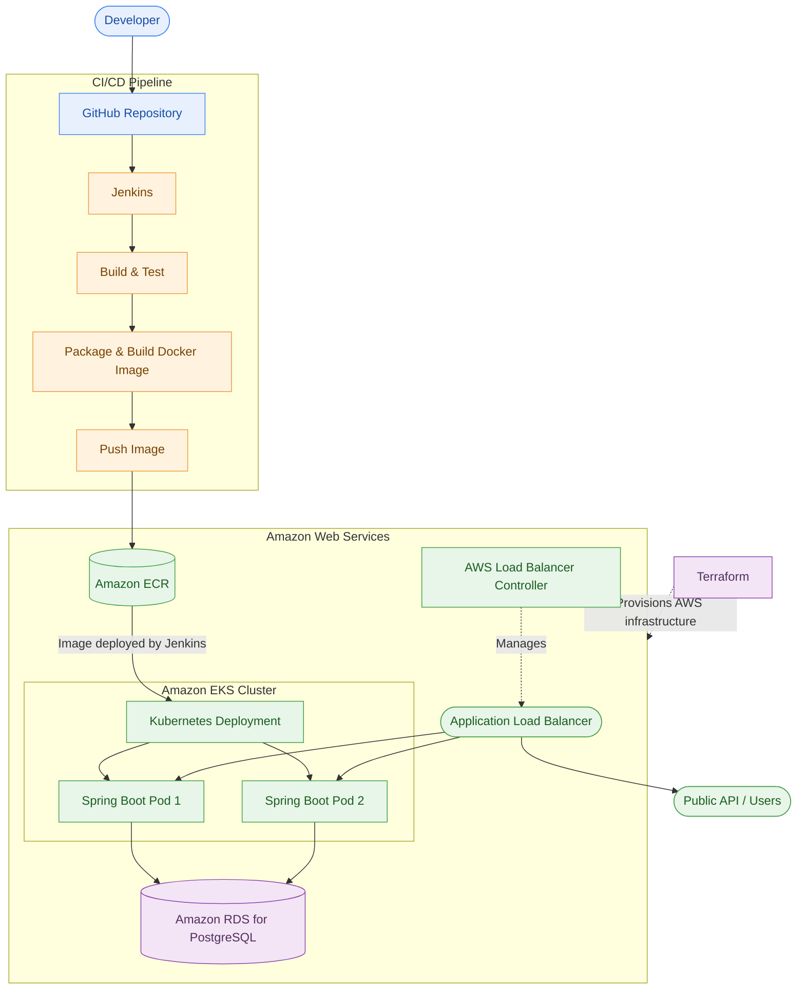

# Cloud DevOps Platform

A portfolio DevOps/SRE project showcasing an end-to-end CI/CD pipeline for a Spring Boot CRUD application, using Jenkins for automation, Docker for containerization, Kubernetes and Amazon EKS for deployment, Amazon ECR for storing container images, AWS and Terraform for cloud infrastructure provisioning, and Amazon RDS for PostgreSQL database storage.

## Architecture

## Tech Stack

- Application: Java, Spring Boot, Maven
- CI/CD: Jenkins
- Containerization: Docker
- Cloud: AWS
- Container Registry: Amazon ECR
- Orchestration: Kubernetes, Amazon EKS
- Load Balancing: AWS Application Load Balancer
- Database: Amazon RDS for PostgreSQL
- Infrastructure as Code: Terraform

## What It Does

1. Developers push code to GitHub.
2. Jenkins builds and tests the application.
3. Maven packages the application and Docker builds the container image.
4. Jenkins pushes the image to Amazon ECR with a build-specific tag.
5. Jenkins updates the Kubernetes Deployment running on Amazon EKS.
6. Kubernetes manages two application replicas and performs health checks.
7. The AWS Load Balancer Controller exposes the application through an internet-facing ALB.
8. The Spring Boot CRUD API can then be accessed publicly.
9. The application stores and retrieves task data in a shared PostgreSQL database hosted on Amazon RDS.

## Key Features

- Automated CI/CD — Jenkins handles build, test, Docker image creation, ECR push, and EKS deployment.
- Containerized application — Multi-stage Docker build with a non-root runtime user.
- Kubernetes deployment — Application runs with two replicas on Amazon EKS.
- Health and reliability — Startup, readiness, and liveness probes are configured for the application.
- AWS integration — ECR stores application images, EKS runs the workloads, and ALB provides public access.
- Database integration — Amazon RDS for PostgreSQL stores task data shared by both application replicas.
- Database security — RDS access is restricted to the EKS node security group, with credentials managed through Kubernetes Secrets.
- Infrastructure as Code — Terraform manages the AWS infrastructure instead of relying on manual provisioning.
- Deployment verification — Jenkins verifies Kubernetes rollout completion and running pods.
- Rollback capability — Kubernetes rollout history and rollback were tested as part of the deployment workflow.
- End-to-end CRUD verification — The deployed public API was verified using real GET, POST, PUT, and DELETE requests.
